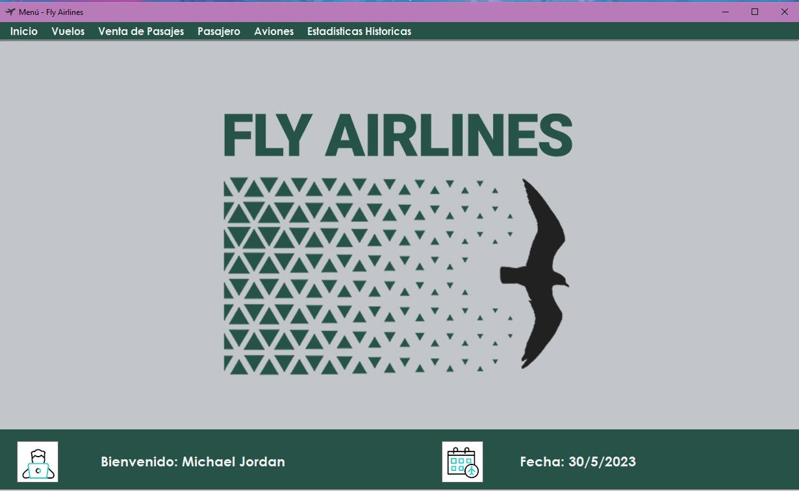
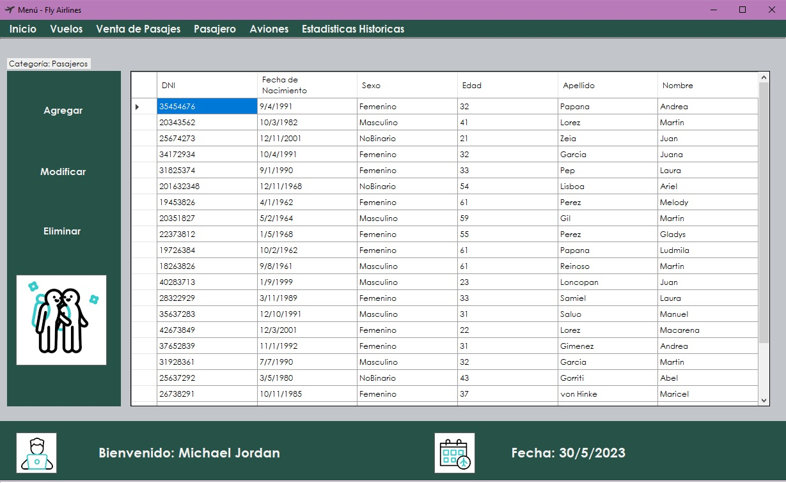

# Fly Airlines App
## _Aplicación de gestión de venta de pasajes_

### Sobre mi:

Mi nombre es Julieta Laplace, tengo 32 años y soy trabajadora social. Me inicié en el camino de la programación en 2019 con cursos dictados por la ciudad de Buenos Aires (codo a codo) por simple curiosidad, y termine encontrando un "mundo nuevo" el cual disfrutaba de estudiar y aprender. Desde ahí decidi ampliar mi conocimiento a un grado educativo mayor como lo es la UTN. Antes de esto jamás habia programado, ya que vengo de estudiar una carrera correspodiente a la ciencias sociales, lo cual implica "dejar de lado" materias que contengan lógica,álgebra, matemática; en secundario o en mi vida en general no tuve aproximación a la programación, por ello a mis 32 años recien estoy adentrandome en el mundo IT.
Con respecto al trabajo/evaluación, debo decir que me costó bastante y no llegue a realizar ciertas acciones (tales como calcular cuanto espacio en bodega queda por cada equipaje cargado, o las mismas estadisticas). La falta de organización fue crucial a la hora de escribir código y generar la aplicación. Este trabajo fue un gran parametro para comprender que temas pude absorber bien y en cuales todavia me falta un poco de comprensión o implementación. También, fue un disparador de algo que no habia vivido todavía: la frustración. Esta evaluación me puso a prueba con mi propia frustración. Hubo días donde festejaba que salieran ciertas cosas (y que las entendiera), y hubo días donde la frustración fue mayor y tuve que aprender a controlarla. En resumen, este trabajo fue un desafío (y lo sigue siendo ya que podría mejorarlo) y fue un gran parámetro para saber que temas tengo afianzados y que temas debo reforzar.

#### Resumen

La aplicación inicia con un login en donde el usuario (puede ser vendedor, administrador o supervisor) se loguean con su correo y contraseña para acceder a la aplicación en si. Si la persona que desea loguearse coloca datos incorrectos, se mostrará un mensaje de error para dar aviso a quien utilice la aplicación. Si los datos son correctos, se abrirá el menú principal, y la ventana de login no será visible.
DATO: La pantalla de login contiene un botón de autocompletar, donde se autollenarán los campos Usuario y Contraseña con los datos correspondientes al supervisor.

Una vez dentro del menú principal, se encuentra una barra con ciertas opciones: inicio, vuelos, venta de pasajes, pasajeros, aviones y estadisticas historicas. Si se clickea en la opcion "Vuelos", se verá un panel con los botones Agregar - Modificar - Eliminar, acompañado de un datagrid el cual listará los vuelos realizados en la empresa:

La opcion de Agregar, eliminar y modificar viajes es exclusiva del usuario administrador, es decir, estas opciones solo aparecerán disponibles para quien se loguee con el perfil de "administrador", los demas usuarios tendran bloqueada dicha accion.

 
La seleccion "Venta de Pasajes" abre un nuevo formulario:

En el mismo se encontrarán cuatro(4) opciones para realizar la venta de pasajes: Cargar Vuelo, Cargar Pasajero, Cargar Equipaje y Generar Factura.
Al seleccionar el boton Cargar vuelo, se abrirá un formulario el cual permitirá filtrar vuelos segun su origen-destino y con la posibilidad del usuario de seleccionar la fecha de partida. A partir de dichas selecciones, se vera un datagrid con todos los vuelos filtrados por busqueda.
El boton "Limpiar", vuelve a mostrar en el datagrid todos los vuelos disponibles.
No es neecsario filtrar un vuelo para poder seleccionarlo desde la lista del datagrid. Con hacer doble click en el vuelo que se requiera, y clickear sobre el boton "Cargar vuelo", se cerrará el formulario y se volverá a ver el formulario de venta de pasaje con la información del vuelo seleccionado.
Si no se selecciona un vuelo y se clickea en el boton "Cargar vuelo", se mostrará un messagebox con el texto "Vuelo no seleccionado", y no se verá información alguna en los datos del vuelo, dentro del formulario de venta de pasajes

Otras de las opciones del menú principal es la referida a Pasajeros:

Al igual que en la opción "Vuelos", pasajeros tambien tiene un panel de botones: Agrear, modificar y eliminar. 
Si se selecciona agregar un cliente,  se abrirá un formulario el cual pedirá todos los datos relacionados al cliente. Este formulario no permite su cierre al menos que se cargue (correctamente) un cliente o se decida cancelar la carga del mismo. Esta opcion esta disponible para los perfiles "vendedor" y "supervisor", quedando bloqueado su uso para el perfil "administrador"

Se puede salir del menú principal, pero al realizar dicha accion, aparecera un messagebox verificando si el usuario desea salir de la aplicación:

 

Si el usuario elige la opción "Si", se cerrará el formulario Menu Principal, y se volverá al formulario de Login, para volver a ingresar con cualquier perfil. Si se clickea "No", el messagebox se cerrará y la aplicación seguirá funcionando.

##### Diagrama
 

#### Justificación técnica
1. Introduccion a .Net y c#
2. Clases y objetos estáticos
3. Programación orientada a objetos
4. Sobrecarga
5. Windows forms
6. Colecciones
7. Encapsulamiento
8. Herencia
9. Poliformismo

Estos son los temas tratados en la evaluación presentada. 
1) .NET Y C#
Se utiliza el lenguaje C#, y se utiliza la plataforma .Net, el cual cito:
> "(...)provee una serie de herramientas y programas para construir fácilmente una gran variedad de software, así como el entorno necesario para ejecutarlo sobre distintos sistemas operativos y tipos de arquitectura".
 
Con dicha plataforma, utilizando el lenguanje C#, se creó este proyecto. .Net nos permite crear software en variedad, dando diversas herramientas (desde librerias propias con funcionalidades preexistentes, compliadores, e inclusive el IntelliSense que el programa posee) al programador para poder conllevar su cometido.
Dentro del proyecto se pueden encontrar fragmentos de código donde se utilizan elementos básicos tales como sentencias de iteración (sentencia for, foreach), operadores lógicos condicionales (if, if else), declaración de variables: Value types (tales como int, float) o Reference Types (Objetos, string). 
Algunos ejemplos dentro del codigo del uso de los mismos son:
` public class Vuelo
    {
        private int codigoVuelo;
        private static int contadorVuelos = 0;
        private string origen;
        private string destino;
        private ETipoViaje tipoDeViaje;
        private Avion unAvion;
        private DateTime diaDePartida;
        private List<Pasajero> pasajeros;
        private int horasDeViaje;
        private bool ofreceComida;
        private bool tieneWifi;
 
        public Vuelo() 
        {
            this.pasajeros = new List<Pasajero>();
            this.origen = "Sin origen";
            this.destino = "Sin destino";
            this.unAvion = new Avion();
            this.codigoVuelo = contadorVuelos;
            Vuelo.contadorVuelos++;
        }
        
        public Vuelo(string origen, string destino, ETipoViaje tipoDeViaje, Avion unAvion, DateTime diaDePartida, bool ofreceComida, bool tieneWifi):this()
        {
            this.origen = origen;
            this.destino = destino;
            this.tipoDeViaje = tipoDeViaje;
            this.unAvion = unAvion;
            this.diaDePartida = diaDePartida;
            this.ofreceComida = ofreceComida;
            this.tieneWifi = tieneWifi;

            Random random = new Random();
            if (tipoDeViaje == ETipoViaje.Nacional)
            {
                horasDeViaje = random.Next(2, 4);
            }
            else
            {
                horasDeViaje = random.Next(8, 12);
            }
        }
    }
`
En este ejemplo se ve el uso de una clase publica especifica llamada Vuelo la cual busca modelar/crear un objeto de tipo vuelo. Este vuelo tendrá ciertas caracteristicas tales una lista de pasajeros, su lugar de salida y de destino, etc. En esta línea de código, se visualiza la declaración de variables de tipo int para definir la duracion del vuelo; una variable booleana esVueloNacional, la cual indicará si el vuelo efectivamente es Nacional o de caracter internacional, etc.
También podemos ver la utilización de un condicional (un if) para asignar las horas de viaje dependiendo si el vuelo es nacional o no.

2) CLASES Y OBJETOS ESTATICOS
Dentro del temario, se encuentra el concepto de Clases, el cual se ejemplifico arriba, pero también se aborda el concepto de clases estáticas. 
En este proyecto se crean diferentes clases con el modificador llamado static, el cual nos provee la capacidad de declarar clases que no seran instanciadas, es decir, no serán creadoras de "objetos a moldear". Estas clases no buscan moldear objetos de la vida cotidiana, si no que buscan facilitar al programador el uso de diversos métodos (funciones que pueden realizarse) dentro del proyecto sin la necesidad de instanciar un objeto para su uso.
Un ejemplo de ello es:
` public static class Empresa
    {
        private static List<Usuario>? usuarios; // DEJO EL ? ?????
        private static List <Avion> aviones;
        private static List<Vuelo> vuelos;
        private static List<Pasajero> pasajeros;
        private static Dictionary<string, int> destinoMasElegido;
        private static Dictionary<Cliente, int> pasajerosFrecuentes;
        private static double gananciaTotalCabojate;
        private static double gananciaTotalInternacional;
        private static string [] destinosNacionales;
        private static string[] destinosInternacionales;
        
        static Empresa()
        {
            usuarios = new List<Usuario>();
            aviones = new List<Avion>();
            vuelos = new List<Vuelo>();
            pasajeros = new List<Pasajero>();
            destinoMasElegido = new Dictionary<string, int>();
            pasajerosFrecuentes = new Dictionary<Cliente, int>();
            destinosInternacionales = new string[4];
            destinosNacionales = new string[15];
            LeerUsuarios();
            HarcodearDestinosNacionales();
            HarcodearDestinosInternacionales();
            HarcodearPasajeros();
            HarcodearAviones();
            HarcodearVuelos();
        }
    }
`
La clase estatica Empresa, no busca instanciar objetos de tipo empresa, si no que busca ser la base del programa a ejecutar. Dentro de esta clase se almacenan diversos datos para el funcionamiento de la app (listas de aviones pertenecientes a la empresa, listado de los usuarios que trabajan y utilizan la aplicación, entre otros), contiene funciones especificas que se ejecutan dentro del programa (funciones que validan el ingreso de un usuario, funciones que muestras una lista de Aviones, etc).

3)POO
Para entender la Programación orientada a objetos, citamos:
>Un paradigma de programación define la forma, metodología o estilo con el que se resolverá un problema utilizando un lenguaje de programación.
(...)La programación orientada a objetos (Object Oriented Programming - OOP) es un paradigma de programación que propone resolver problemas a través de identificar objetos de la vida real, sus atributos (datos), su comportamiento (acciones) y las relaciones de colaboración entre ellos.

En este trabajo, se aplica el paradigma de la programación orientada a objetos, ya que creo que todos los elementos propios de una empresa, la cual se encarga de vender tickets de vuelo a diversas personas (entre otras cosas), púede ser modelada (crear objetos con sus atributos, caracteristicas etc) para ser representada en código C#.
El ejemplo claro de ello es pensar a los pasajeros, vuelos, pasaje, aviones como objetos que podemos modelar, que tienen sus caracteristicas particulares (atributos), sus funciones (métodos) y demás.
Un ejemplo dentro del código es la clase Equipaje:
`public class Equipaje
    {
        private int cantidadValijas;
        private float pesoTotalValija;
        public Equipaje()
        {
            this.pesoTotalValija = 0;
            this.cantidadValijas = 0;
        }
        public Equipaje(int cantidadValijas, float pesoTotalValija)
        {
            this.cantidadValijas = cantidadValijas;
            this.pesoTotalValija = pesoTotalValija;
        }

        public int CantidadValijas
        {
            get { return this.cantidadValijas; }
            set { this.cantidadValijas = value;}
        }

        public float PesoTotalValija
        {
            get { return this.pesoTotalValija; }
            set { this.pesoTotalValija= value; }
        }

        public override string ToString()
        {
            return $"Cantidad de valijas: {this.CantidadValijas} - Peso total: {this.PesoTotalValija}";
        }

    }
`
La clase equipaje es un "molde" desde el cual se crearán los diversos equipajes que llevaran los pasajeros dentro de un vuelo. Se considera que el objeto equipaje tiene como atributo principal la cantidad de valijas que llevará el pasajero, y el peso que las mismas tienen.
Por cada pasajero que quiera viajar, se creará (o no dependiendo de las necesidades del pasajero) un objeto Equipaje con estos atributos.
4) SOBRECARGA
La sobrecarga se entiende como:
>"Permite declarar miembros con el mismo nombre en la misma clase, siempre y cuando tengan distintos conjuntos de parámetros.
(...)La sobrecarga consiste en crear dos o más miembros (métodos, constructores o indexadores) con el mismo identificador (mismo nombre), dentro de la misma clase, cambiando el número de parámetros, tipo de parámetros u orden de los tipos."

La sobrecarga de métodos, nos ayudará en la reutilización y simplificación de código, para no generar "Código repetido". Un ejemplo dentro del codigo es la sobrecarga del metodo Eliminar:
`public static void Eliminar(Pasajero pasajero)
        {
            foreach (Pasajero item in pasajeros)
            {
                if (pasajero == item)
                {
                    pasajeros.Remove(pasajero);
                    break; 
                }
            }
        }
        public static void Eliminar(Avion avion)
        {
            foreach (Avion item in aviones)
            {
                if (avion == item)
                {
                    aviones.Remove(avion);
                    break;
                }
            }
        }
        public static void Eliminar(Vuelo vuelo)
        {
            foreach (Vuelo item in vuelos)
            {
                if (vuelo == item)
                {
                    vuelos.Remove(vuelo);
                    break;
                }
            }
        }
`
Éste método es "igual" en su código, ya que su funcionalidad es la misma: eliminar un objeto de una lista. Se sobrecarga el método para poder enviarle especificamente que es lo que debe eliminar. El funcionamiento del método es el mismo para todos los casos de eliminar, lo que modifica es el valor (objeto) que se elimina dentro de una lista especifica.

5)WINDOWS FORMS
Para generar una interacción con el usuario que utilizara la aplicación, el cual no solo contendrá la logica del programa, si no también el diseño del mismo, se utilizan los formularios de Windows Forms.

>Windows Forms es una tecnología que permite crear aplicaciones gráficas para escritorio en Windows. Ofrece capacidades para definir visualmente todo tipo de ventanas y controles dentro de éstas, y además facilita la creación de interfaces orientadas al manejo de datos gracias a sus capacidades de enlace bi-direccional a datos (capa lógica - capa visual).

A partir de diversos formularios creados, se genera la parte logica-visual de la aplicación en si, para poder generar esta interacción con el usuario.

6)COLECCIONES
Las colecciones que se utilizan en el código son las siguientes:
`
private static List<Vuelo> vuelos;
private static List<Pasajero> pasajeros;
private static Dictionary<string, int> destinoMasElegido;
`
Por falta de organizacion, no pude utilizar Dictionary<string, int> destinoMasElegido; Pero mas alla de ello, las colecciones son  estructuras de datos las cuales me permitieron almacenar y manipular diversos conjuntos de elementos. con ellas pude agregar, modificar y eliminar objetos contenidos dentro de estas listas (estas coelcciones son genericas, es decir, son colecciones de un mismo tipo de dato).

8) HERENCIA

En este trabajo, se utilizó la herencia especificamente en la relacion entre la clase Persona con sus clases derivadas Persona-Usuario y Persona-Pasajero. La clase base (Persona) contiene como atributos el nombre y el apellido, atributos que serán heredados en sus clases derivadas Usuario y Pasajero. Éstas clases hijas tienen (ademas de los atributos provenientes de la clase base) sus propios atributos. En el caso de Usuario, un atributo propio es su correo y su clave, las cuales lo hacen propio de Usuario ya que son sus herramientas para loguearse en la aplicacion.
Por parte de Pasajero, ademas de los atributos base (nombre y apellido), tambien cuenta con atributos tales como una lista de viajes (List<Viaje>) donde se guardan todos los viajes que realizó (y lo que lo hace un pasajero dentro de la aplicacion y no un usuario). 
También podemos hablar de la herencia grafica, en el momento que se realizó herencia de formularios.
Dentro del código, se encuentra la clase base FrmAgregarAvion, la cual contiene ciertos controles, y métodos para agregar un Avión a una lista de aviones de nuestra clase estática Empresa:
`
public partial class FrmAgregarAvion : Form
    {
        public FrmAgregarAvion()
        {
            InitializeComponent();
        }

        private void FormAgregarAvion_Load(object sender, EventArgs e)
        {
            this.cboAviones.DataSource = Enum.GetValues(typeof(EAvion));
            this.cboAviones.SelectedIndex = 0;
            this.domUpDownAsientos.Items.Add(200);
            this.domUpDownAsientos.Items.Add(150);
            this.domUpDownAsientos.Items.Add(100);
            this.domUpDownCantidadBanios.Items.Add(4);
            this.domUpDownCantidadBanios.Items.Add(2);
            this.domUpDownCapacidadMaxima.Items.Add(200.6);
            this.domUpDownCapacidadMaxima.Items.Add(150.5);
            this.domUpDownCapacidadMaxima.Items.Add(100.3);
            this.domUpDownAsientos.SelectedItem = 200;
            this.domUpDownCapacidadMaxima.SelectedItem = 100.3;
            this.domUpDownCantidadBanios.SelectedItem = 2;
            this.btnBoton1.Text = "Agregar";
        }

        private void txtMatriculaAvion_TextChanged(object sender, EventArgs e)
        {

            if (this.txtMatriculaAvion.Text.Length > 8 )
            {
                MessageBox.Show("La matrícula no puede tener más de 8 caracteres.");
                this.txtMatriculaAvion.Clear();
            }
            else if (!Validador.ValidarAlfanumerico(this.txtMatriculaAvion.Text))
            {
                MessageBox.Show("La matrícula debe tener caracteres alfanumericos.");
                this.txtMatriculaAvion.Clear();
            }
        }

        protected virtual void btnBoton1_Click(object sender, EventArgs e)
        {
            if (string.IsNullOrEmpty(this.txtMatriculaAvion.Text) )
            {
                MessageBox.Show("Debe ingresar una matrícula para el avión.");
                return; //cancela el agregarAvion
            }
            int cantidadAsientos = Convert.ToInt32(this.domUpDownAsientos.SelectedItem); //devuelve tipo objetc
            int cantidadBanios = Convert.ToInt32(this.domUpDownCantidadBanios.SelectedItem);//devuelve tipo object
            float capacidadMaximaBodega = Convert.ToSingle(this.domUpDownCapacidadMaxima.SelectedItem);
            string matricula = this.txtMatriculaAvion.Text;
            EAvion avionSeleccionado = (EAvion)this.cboAviones.SelectedValue;

            if (VerifcarSiAvionExiste(matricula))
            {
                MessageBox.Show("Ya existe un avión con la misma matrícula.");
                this.txtMatriculaAvion.Clear();
                return; //cancela el agregarAvion
            }else
            {
                Empresa.AgregarAvion(avionSeleccionado, matricula, cantidadAsientos, cantidadBanios, capacidadMaximaBodega);
                MessageBox.Show("Avion agregado con exito.");
                this.DialogResult = DialogResult.OK;
            }
           
        }
        protected virtual void btnCancelar_Click(object sender, EventArgs e)
        {
            this.DialogResult = DialogResult.Cancel;
        }

        public bool VerifcarSiAvionExiste(string matricula)
        {
            bool existe = false;
            foreach (Avion item in Empresa.ListarAviones())
            {
                if (item.Matricula== matricula)
                {
                    existe = true; 
                }
            }
            return existe;
        }
    }
`

Esta clase es la clase base de dos formularios derivados FrmEliminarAvion: 
`public partial class FrmEliminarAvion : FrmAgregarAvion
    {
        Avion avionRecibido;
        public FrmEliminarAvion(Avion avion) : base()
        {
            InitializeComponent();
            this.avionRecibido = avion;
        }

        private void FrmEliminarAvion_Load(object sender, EventArgs e)
        {
            base.btnBoton1.Text = "Eliminar";
            base.cboAviones.Enabled = false;
            base.cboAviones.SelectedItem = avionRecibido.Nombre;
            base.domUpDownAsientos.Enabled = false;
            base.domUpDownAsientos.SelectedItem = avionRecibido.CantidadDeAsientos;
            base.domUpDownCantidadBanios.Enabled = false;
            base.domUpDownCantidadBanios.SelectedItem = avionRecibido.CantidadDeBanios;
            base.domUpDownCapacidadMaxima.Enabled = false;
            base.domUpDownCapacidadMaxima.SelectedItem = avionRecibido.CapacidadBodega;
            base.txtMatriculaAvion.Enabled = false;
            base.txtMatriculaAvion.Text = avionRecibido.Matricula;
        }
        protected override void btnCancelar_Click(object sender, EventArgs e)
        {
            this.DialogResult = DialogResult.Cancel;
        }

        protected override void btnBoton1_Click(object sender, EventArgs e)
        {
            this.DialogResult = DialogResult.OK;
            MessageBox.Show("Avion eliminado con exito");
        }
    }
`
Y FrmModificarAvion:
`
    public partial class FrmModificarAvion : FrmAgregarAvion
    {
        Avion avionRecibido;
        public FrmModificarAvion(Avion avion) : base()
        {
            InitializeComponent();
            this.avionRecibido = avion;
        }
        private void FrmModificarAvion_Load(object sender, EventArgs e)
        {
            base.btnBoton1.Text = "Modificar";
            base.txtMatriculaAvion.Text = avionRecibido.Matricula;
            base.txtMatriculaAvion.Enabled = false;
            base.cboAviones.SelectedItem = avionRecibido.Nombre;
            base.domUpDownCapacidadMaxima.SelectedItem = avionRecibido.CapacidadBodega;
            base.domUpDownCantidadBanios.SelectedItem = avionRecibido.CantidadDeBanios;
            base.domUpDownAsientos.SelectedItem = avionRecibido.CantidadDeAsientos;
            base.txtMatriculaAvion.Text = avionRecibido.Matricula;

        }

        protected override void btnBoton1_Click(object sender, EventArgs e)
        {
 
                Empresa.Modificar(avionRecibido, (EAvion)this.cboAviones.SelectedValue, Convert.ToInt32(this.domUpDownAsientos.SelectedItem), Convert.ToInt32(this.domUpDownCantidadBanios.SelectedItem), Convert.ToSingle(this.domUpDownCapacidadMaxima.SelectedItem));
                MessageBox.Show("Avion modificado con exito");
                this.DialogResult = DialogResult.OK;

        }

        protected override void btnCancelar_Click(object sender, EventArgs e)
        {
            base.DialogResult = DialogResult.Cancel;
        }

        public bool VerificarAvionEnVuelo(Avion avion, List<Vuelo> lista)
        {
            return true;
        }
    }
`

Estos formularios comparten graficamente todos sus controles (botones, labels, y demas utilizados), lo cual nos simplifica a la hora de escribir código. Cabe destacar que aun teniendo una herencia grafica, los tres formularios tienen funcionalidades distintas gracias al POLIFORMISMO utilizado.
Utilice el poliformismo sobretodo en los metodos que llevan eventos. Por ejemplo, en los click de los botones. Dependiendo del formulario utilizado, el boton "boton1" presente en todos los formularios (base-derivados) tendra una sobreescritura de su metodo el cual se adaptará a su funcionalidad.
Aqui el ejemplo:

boton1 en formulario base (formulario que agrega aviones):
`
 protected virtual void btnBoton1_Click(object sender, EventArgs e)
        {
            if (string.IsNullOrEmpty(this.txtMatriculaAvion.Text) )
            {
                MessageBox.Show("Debe ingresar una matrícula para el avión.");
                return; //cancela el agregarAvion
            }
            int cantidadAsientos = Convert.ToInt32(this.domUpDownAsientos.SelectedItem); //devuelve tipo objetc
            int cantidadBanios = Convert.ToInt32(this.domUpDownCantidadBanios.SelectedItem);//devuelve tipo object
            float capacidadMaximaBodega = Convert.ToSingle(this.domUpDownCapacidadMaxima.SelectedItem);
            string matricula = this.txtMatriculaAvion.Text;
            EAvion avionSeleccionado = (EAvion)this.cboAviones.SelectedValue;

            if (VerifcarSiAvionExiste(matricula))
            {
                MessageBox.Show("Ya existe un avión con la misma matrícula.");
                this.txtMatriculaAvion.Clear();
                return; //cancela el agregarAvion
            }else
            {
                Empresa.AgregarAvion(avionSeleccionado, matricula, cantidadAsientos, cantidadBanios, capacidadMaximaBodega);
                MessageBox.Show("Avion agregado con exito.");
                this.DialogResult = DialogResult.OK;
            }
           
        }
`

boton 1 sobreescrito en el formulario derivado que elimina un avion
`
protected override void btnBoton1_Click(object sender, EventArgs e)
        {
            this.DialogResult = DialogResult.OK;
            MessageBox.Show("Avion eliminado con exito");
        }
`
boton1 sobreescrito en el formulario derivado que modifica un avion:
`
      protected override void btnBoton1_Click(object sender, EventArgs e)
        {
 
                Empresa.Modificar(avionRecibido, (EAvion)this.cboAviones.SelectedValue, Convert.ToInt32(this.domUpDownAsientos.SelectedItem), Convert.ToInt32(this.domUpDownCantidadBanios.SelectedItem), Convert.ToSingle(this.domUpDownCapacidadMaxima.SelectedItem));
                MessageBox.Show("Avion modificado con exito");
                this.DialogResult = DialogResult.OK;

        }
`
POLIMORFISMO (COMPLETAR)

